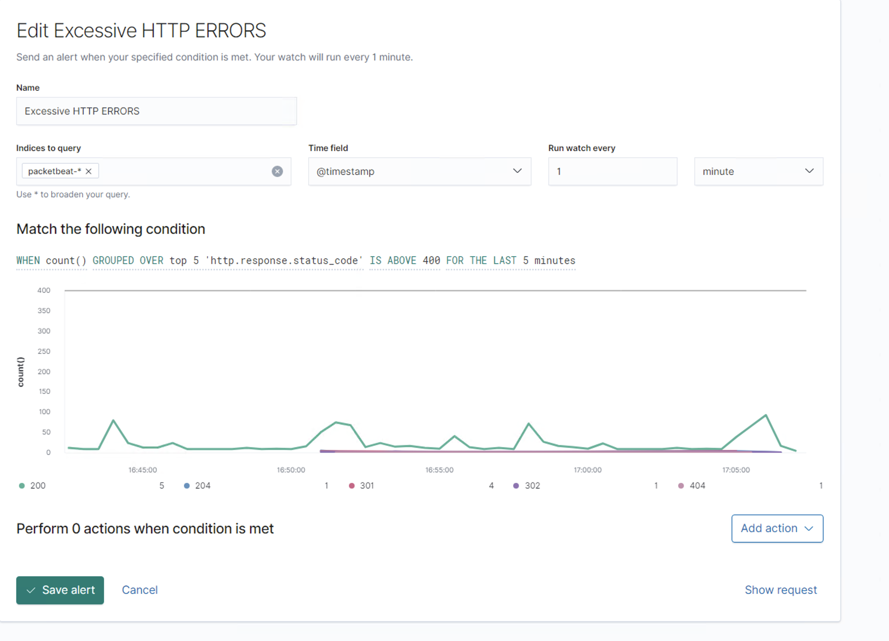

# Blue Team: Summary of Operations

## Table of Contents
- Network Topology
- Description of Targets
- Monitoring the Targets
- Patterns of Traffic & Behavior
- Suggestions for Going Further

### Network Topology

The following machines were identified on the network:
- Name of VM 1: Kali 
  - Operating System: Kali Linux
  - Purpose: Attack Target 1 machine
  - IP Address: 192.168.1.90

- Name of VM 2: Target 1
  - Operating System: Debian
  - Purpose: Attacked by Kali Linux:
  - IP Address 192.168.1.110:

- Name of VM 3: Elk Server
  - Operating System: Ubuntu 
  - Purpose: Monitoring traffic:
  - IP Address 192.168.1.100

### Description of Targets

The target of this attack was: `Target 1` (192.168.1.110).

Target 1 is an Apache web server and has SSH enabled, so ports 80 and 22 are possible ports of entry for attackers. As such, the following alerts have been implemented:

### Monitoring the Targets

Traffic to these services should be carefully monitored. To this end, we have implemented the alerts below:

Alert 1 is implemented as follows: EXCESSIVE HTTP ERRORS

  - **Metric**: Packetbeat
  - **Threshold**: 400
  - **Vulnerability Mitigated**: bruteforce
  - **Reliability**: TODO:This alert is Reliable

Alert 2 is implemented as follows: CPU USAGE MONITOR

  - **Metric**: Metricbeat
  - **Threshold**: 0.5
  - **Vulnerability Mitigated**: DOS (Denia of Service)
  - **Reliability**: Reliability is low because you can have heavy and legitimate processess .running

Alert 3 is implemented as follows: HTTP REQUEST SIZE NONITOR

  - **Metric**: Metricbeat
  - **Threshold**: 40000000
  - **Vulnerability Mitigated**: It forbids regular users from becoming admin users
  - **Reliability**: It is against port scanning therfore its reliable.

### Suggestions for Going Further (Optional)

The logs and alerts generated during the assessment suggest that this network is susceptible to several active threats, identified by the alerts above. In addition to watching for occurrences of such threats, the network should be hardened against them. The Blue Team suggests that IT implement the fixes below to protect the network:
- Vulnerability Weak password
  - **Patch**: Input strong passwowrd policy.
  - **Why It Works**: Because you will not be able to bruteforce or guess password. 
- Vulnerability File Listing
  - **Patch**: Block port 80
  - **Why It Works**: TODO: Because we can see the server files on the browser because port 80 is not secure.
- Vulnerability Privileges escalations
  - **Patch**: remove python access from steven
  - **Why It Works**: Because was able to access the root with his python access.# github-upload NetworkSecurityReports OffensiveTemplate.md finalprojectimages
