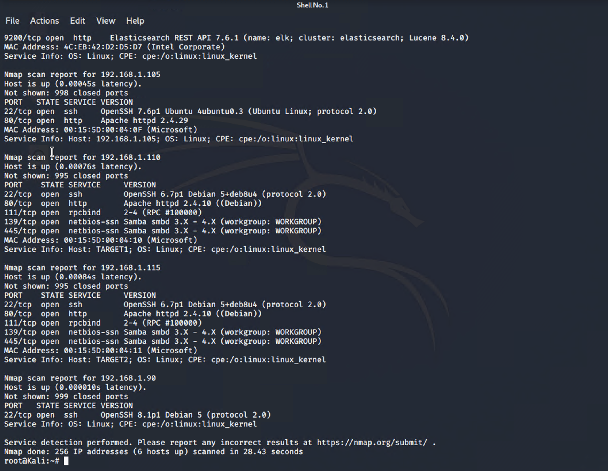
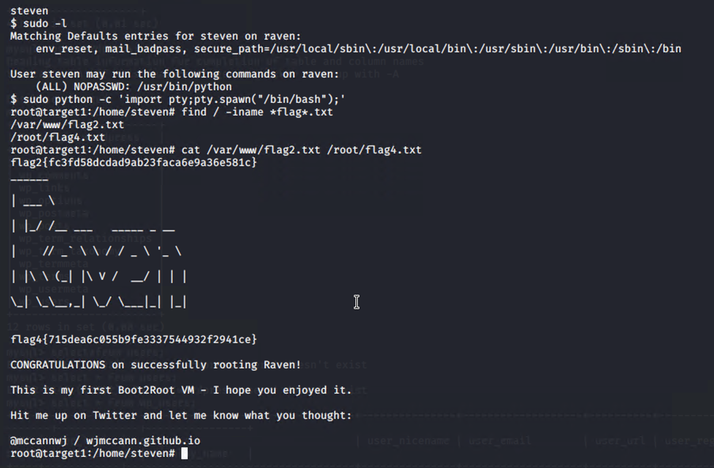
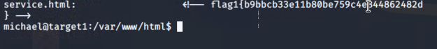
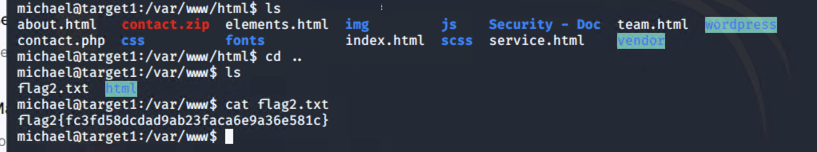

# Red Team: Summary of Operations

## Table of Contents
- Exposed Services
- Critical Vulnerabilities
- Exploitations

### Exposed Services

Nmap scan results for each machine reveal the below services and OS details:

```bash
$ nmap ... # TODO: Add command to Scan Target 1


This scan identifies the services below as potential points of entry:
- Target 1 192.168.1.110
  - Exposed Services open ssh. apache and samba

Fill out the list below. Include severity, and CVE numbers, if possible._

The following vulnerabilities were identified on each target:
- Target 1
  - 
  Weak password, 
  file listing and 
  priveliage escalations

Include vulnerability scan results to prove the identified vulnerabilities._


### Exploitation

The Red Team was able to penetrate `Target 1` and retrieve the following confidential data:
- Target 1
  - `flag1.txt`:
  
  hash value_
    - **Exploit Used**
      - Identify the exploit used_ Michales password guessing
      - Include the command run_ssh michael@192.168.1.110
  - `flag2.txt`: hash value_
    - **Exploit Used**
      - Identify the exploit used_Michales password guessing
      - Include the command run ssh michael@192.168.1.110
